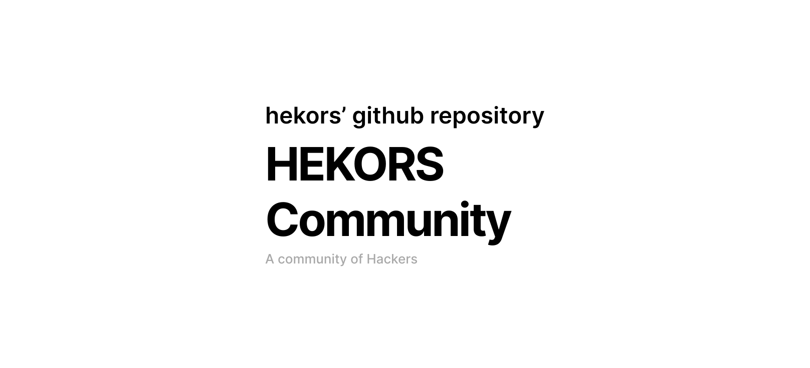

  <h3 class="description-content-title">Template GitHub Repository</h3>
  This repository will be used to create repositories according to HEKORS community requirements.

  The purpose of this repository is to keep all the community health files that we would normally have to duplicate in each repository. These are global community files that apply to repositories that do not have their own files.

